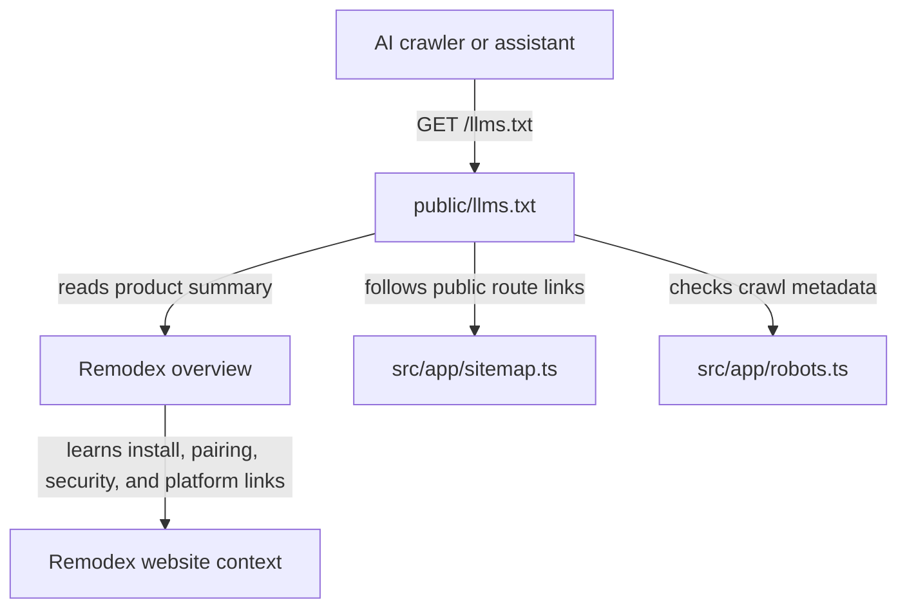

# Recap: llms.txt
> Generated: 2026-06-02  |  Scope: 2 files

---

## Summary

The goal was to add a root-level `/llms.txt` to make the Remodex website easier for AI crawlers and assistants to understand. I added a Markdown-style AI index in `public/llms.txt` modeled after Factory's `llms.txt` structure, with a product summary, important public routes, product links, technical highlights, and discovery links. The file is now ready to be served from `https://www.remodex.site/llms.txt` after deployment.

---

## Files Affected

| File | Status | Role |
|---|---|---|
| `public/llms.txt` | ✅ Created | Root-served AI discovery index for Remodex |
| `RECAP-llms-txt.md` | ✅ Created | Implementation recap required by the project instructions |

---

## Logic Explanation

### Problem

The site did not have a root `/llms.txt` file. That means AI crawlers or assistants looking for a compact, model-friendly summary of the product would need to infer everything from regular pages, legal text, screenshots, or sitemap entries.

### Approach

I used Factory's `llms.txt` as the pattern: a short Markdown document that summarizes the product and lists important resources as links. Because this is a Next.js app, the right place for a root static file is `public/`, which means `public/llms.txt` will be served directly at `/llms.txt`.

### Step-by-step

1. I read the Factory example and identified its structure: heading, one-line product summary, categorized links, and supporting references.
2. I inspected the Remodex metadata, sitemap, home page sections, FAQ, Android beta page, privacy policy, terms, and shared GitHub constants.
3. I created `public/llms.txt` with the canonical Remodex domain, the current public routes, the App Store and Android beta links, the GitHub repository, setup commands, and the security/runtime model.
4. I ran the production build to verify the app still compiles and that the static-file addition does not disturb any existing routes.

### Tradeoffs & Edge Cases

The file follows the emerging `llms.txt` convention, but no crawler can be forced to use it, so it should be treated as an AI discovery aid rather than a guaranteed SEO ranking lever. The Android beta page currently links a different GitHub release owner than the main shared repository constant, so the `llms.txt` keeps both where they are already publicly represented instead of silently picking one.

---

## Flow Diagram

### Happy Path

---

## High School Explanation

Imagine the website is a school, and an AI is a new student trying to figure out where everything is.

Before this change, the AI had to wander around the halls and read every poster. Now there is a simple welcome sheet at the front door called `llms.txt`.

That sheet says what Remodex is, where the important pages are, how setup works, and which links matter. It does not magically guarantee more visitors, but it makes the site much easier for AI tools to understand quickly.
